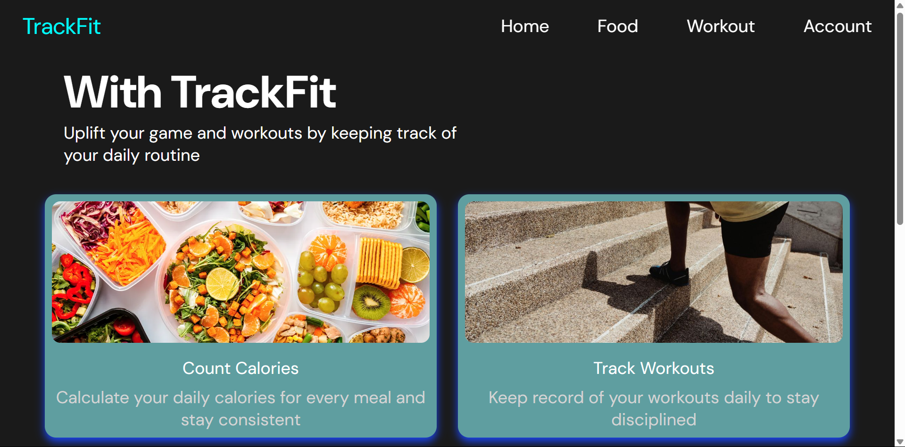
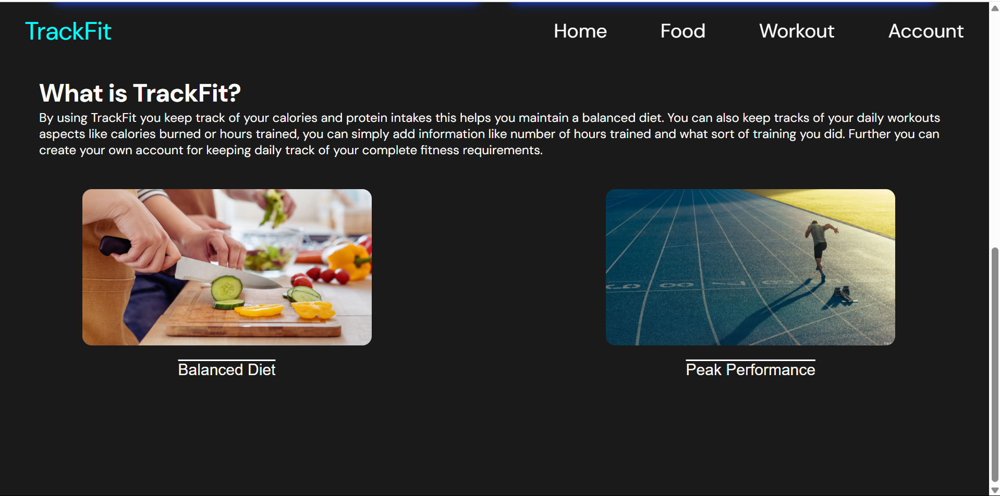
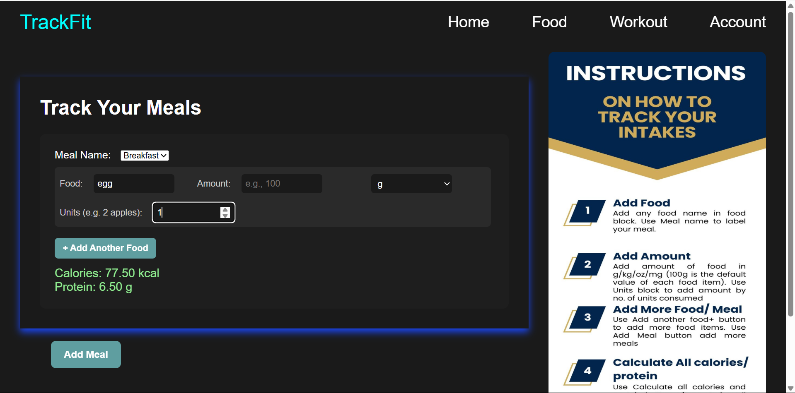
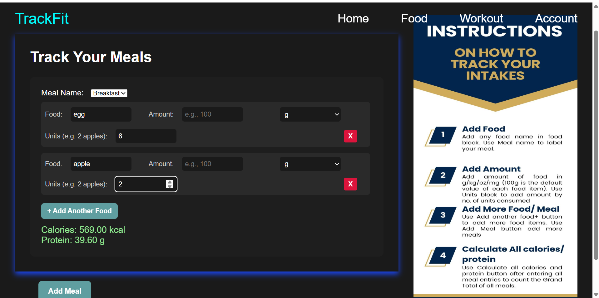
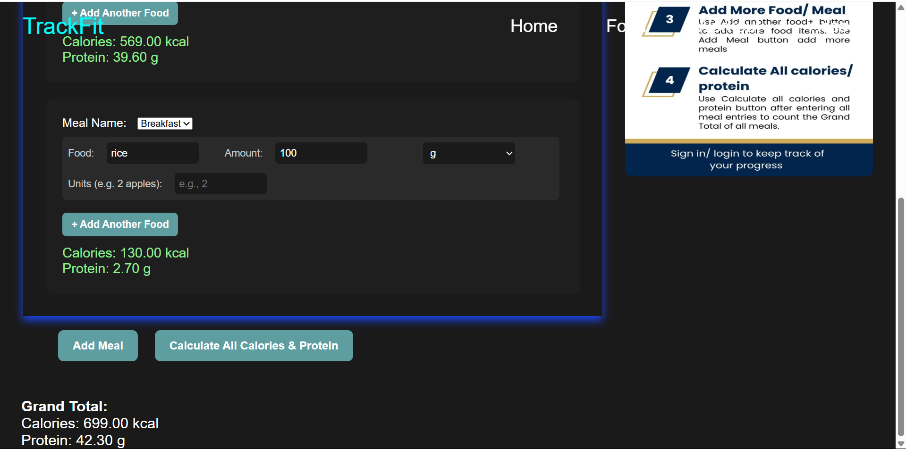

# 🏋️ TrackFit – Your Personal Fitness and Calorie Tracker

**TrackFit** is a modern full-stack web application designed to help users stay on top of their daily nutrition and fitness goals. Whether you're aiming to lose weight, build muscle, or just eat healthier, TrackFit provides a simple and intuitive platform to log meals, monitor calorie intake, and track protein consumption with ease.

## Features

-  **Meal Tracking** – Add food items under predefined or custom meal types (Breakfast, Lunch, Dinner, Snacks).
-  **Custom Entries** – Input food quantity in grams or units (like “2 apples”) and get automatic calorie & protein calculations.
-  **Dynamic Meal Blocks** – Add multiple food items in each meal with the ability to expand meal sections.
-  **Clean UI** – Responsive design with a modern black theme and easy navigation using a top navbar.
-  **Database Integration** – Connects with PostgreSQL to fetch nutritional data from a food items table.
-  **Real-Time Updates** – Instant display of calories and protein as you input food entries.
-  **Future Plans** – Add user authentication, daily/weekly progress charts, and save/load history functionality.

## Tech Stack

- **Frontend**: HTML5, CSS3, JavaScript (Vanilla)
- **Backend**: Node.js, Express.js
- **Database**: PostgreSQL
- **Hosting/Version Control**: GitHub

## Screenshots

